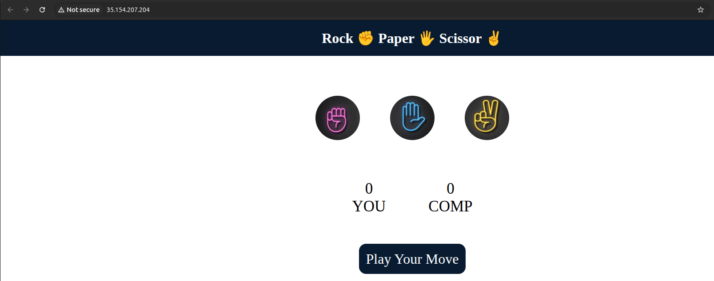

1. Project Title
### Rock Paper Scissor Game - Hosted on AWS EC2.

2. Features
### - Simple and interactive game.
### - HTML, CSS, JavaScript based frontend.
### - Fun graphics for Rock, Paper, and Scissors.

3. How to Play
### - Click on Rock, Paper, or Scissor.
### - The computer randomly picks one.
### - You win, lose, or draw based on the logic.

4. Hosted Link (EC2)
### Live Game: [http://35.154.207.204/](http://35.154.207.204/)
### Note: The game was hosted on my AWS Free Tier EC2 instance. Since the instance may not always be running, the live site link might be temporarily unavailable. Therefore, I have attached screenshots of the hosted game as a reference.

5. Tech Stack
### - Frontend: HTML, CSS, JavaScript
### - Hosting: AWS EC2 (Amazon Linux 2, Apache)

6. Screenshots
###  Game Screenshot

### ☁️ EC2 Instance Screenshot

### 📁 GitHub Repository Screenshot

